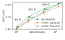

# Photon Inhibition for Energy-Efficient Single-Photon Imaging

Lucas J. Koerner [koerner.lucas@stthomas.edu](mailto:koerner.lucas@stthomas.edu)

This code was developed for the paper:

Lucas J. Koerner, Shantanu Gupta, Atul Ingle, Mohit Gupta.
*Photon Inhibition for Energy-Efficient Single-Photon Imaging* in Proceedings of the European Conference on Computer Vision (ECCV) 2024.

Here's the project [website](https://wisionlab.com/project/inhibition)!

<p align="center" width="150%">
  
  <figcaption> <b> Photon inhibition for resource-efficient passive SPAD imaging. </b>
(a) Unlike conventional CMOS cameras (CIS), the energy consumption in SPAD cameras increases with scene brightness, severely limiting the applicability of high resolution SPAD cameras in resource-constrained applications.
(b) We expand the conventional imaging pipeline to incorporate ``inhibition'' that electronically enables or disables individual pixels to limit bandwidth and power consumption.
Our method relies on lightweight mathematical operations called ``inhibition policies'' that update the inhibition patterns based on the history of photon detections.
Inhibition policies can be optimized for image SNR or for downstream vision tasks.(c,d) Object detection, a high-level vision task, is successful even with a large fraction of photons inhibited. </figcaption>
</p>

## Overview of Repository

This code repository consists of:

1) Monte Carlo simulations of binary images with inhibition policies applied (in the top-level directory).
2) Analytical analysis of photon inhibition policies in the folder *analytical*.
3) Data analysis and visualization methods in the folder *plotting*.

## Modules

### Create binary images

The Python code *create_binary_images.py* loads image files such as \*.png, \*.jpeg, or \*.exr and simulates single-photon sampling (Bernoulli) of the grayscale intensity in each pixel. Since the simulations are computationally intensive we save the resulting binary frames to disk as a numpy binary file (\*.npy) of size WxHxN where N is the total number of binary frames. A companion JSON file is also saved that logs the configurations of the simulation. Bernoulli sampling is done via a lookup table which dramatically increases the speed of simulation. The input parameters to *create_binary_images.py* are:

- figure_dir : the directory that the images are stored. Simulation results (.npy and .json) will be saved in the same directory.
- img_file_range : The images to simulate (either string or length 2 list of integers). If None the number of images simulated is set by max_images.
- thresholds : list of 2 element tuple (historical). Of the form [(None, float)] where float is the average photons per pixel (sets the "exposure time").
- extension : searches for and simulates only images with this extension.
- max_images:

Within the script the configuration dictionary is used for options such as the number of binary frames simulated.
```python
cfg['max_frames'] = 1000  # N the number of binary frames
```
There is also the option to simulate just a thumbnail using an ROI of the input image.

**Important dependencies:** uses *create_bern_frames* and *bernoulli_lookup* from bernoulli_inhibit.py

**Slurm interface:** The slurm script *make_binary.slurm* is used with a typical call to Python of
```bash
python create_binary_images.py '/home/datasets/100samplesDataset/wideDR10_x4resize/' 0.1
```
where the input arguments are the figure directory and the exposure time (second parameter in the *thresholds* above). Note that the exposure time is in average photons per pixel and must be a float (1.0 rather than 1).

### Simulate inhibition policies

*make_slurms_compareimgs.py* is a Python file that loops through various tuning parameters (image name, spatial Kernel ($K_s$), inhibition threshold ($\eta$), and holdoff time ($\tau_H$)), writes, and launches Slurm jobs for each set of parameters. For each parameter set, the code reads and edits a Slurm template file. 
An example Slurm template file is *run_compareimgs_hdr.slurm*. This template is used to to create a new Slurm job with specific inhibition parameters that is launched. After all the jobs complete these Slurm launcher files need to be deleted. 

The Slurm job runs:
```
python3 run_script_compareimgs.py inhibit_length img_name inhibit_thresh kernel_name
```
This script loads and runs the *main* method from *weighted_summary.py* which calls the main function from *tests/inhibit_results_tests.py*. 
The analysis applies the function *determine_masks* from *bernoulli_inhibit.py* onto an InhibitResult object for each exposure time within a bracket.

The `InhibitResult` class is defined in *inhibition_captures.py*. The properties include:

- img_path
- ppp : photons per pixel
- spatial_kernel and other properties of the inhibition policy.
- captures : the captured binary frames with inhibition. This tracks the counts in each pixel for each accumulated frame number and the number of uninhibited (unmasked) frames.
- captures_nomask : the captured binary frames without inhibition. This tracks the counts in each pixel for each accumulated frame number and the number of uninhibited (unmasked) frames.

The estimated binary rate is then calculated after a given number of frames `i` as:
```python
import numpy as np
p = np.divide(self.captures[i]['counts'], self.captures[i]['unmasked']) # estimate of the binary rate
```
The method `calc_metrics` calculates and stores image quality metrics of MSE, MSRE (mean square relative error), SSIM, and the MSE of the gradient magnitude. These metrics are calculated after each accumulated frame in the sequence so that assessments can be made versus the total number of accumulated frames (i.e. SSIM after 10 frames and SSIM after 200 frames). `calc_metrics` also summarizes the number of photons, measurements, photons per pixel, and measurements per pixel for both inhibition and no inhibition.

The `InhibitResults` class is defined in *inhibition_captures.py* and is a list of `InhibitResult` objects that is used for exposure bracketing and has other useful methods.

### Simulation Outputs

For each set of parameters (Kernel type, threshold, inhibition length) the simulations save:

1. A Python pickle of the InhibitionResults object (`irs_pickle`)
2. Plots of metrics versus photons, measurements for both individual exposure levels and exposure bracket combinations. 
3. A Python pickle of the distributions of measurements that can be plotted (`measure_dist_data_{filename}`). Note that storing every pixel value of measurements versus intensity is impractical (that's a whole image!) so we plot the results of Lowess fits to these distributions.  
4. Images with and without inhibition  at various average detections per pixel (e.g., `img_1phpp_mask`, `img_1phpp_nomask`) as Python pickles. Typically: 1, 2, 5, 8, 12, 16, 20,24, 30, 50, 80, 200 average photons per pixel.  

### Visualization tools

- *plotting/teaser_images.py* is used to create the images and various detection levels that are used as comparisons in collages such as Fig. 5.

- *plotting/supplement_images.py* produces similar outputs and also adds the images of the inhibition patterns. 

- *plotting/analyze_fscore.py* analyzes and plots the HED edge detection results. 

## Figure generation

### Main manuscript

#### Fig. 3 **Efficiency metrics and inhibition policies that track the metrics**

<p align="center" width="300%">
 
</p>

Created by:  
  - analytical/snr_efficiency.py (left-most chart) figure name: *snr_both_eff*
  - plotting/analyze_batch_runs.py (center and right-most chart) figure name: `f'measurements_thresh_twometrics_kernel{kernel}'`

The two figures were then combined using Inkscape. 

#### Fig. 5 **Power-efficient static imaging via inhibition**

<p align="center" width="300%">
 
</p>

Created by:  
  - *plotting/box_whisker_script.py*
  - *plotting/analyze_batch_runs_bracket.py* 
  - *plotting/teaser_images.py* reates images at various detection levels that are used as comparisons.
  - *plotting/supplement_images.py* creates images of the inhibition patterns (\%) at each exposure level.

The final collage was then created with Inkscape. 
 
#### Fig. 6 **Energy-efficient edge detection by inhibition**

<p align="center" width="300%">
  
</p>

Created by:  
  - *plotting/analyze_fscore.py*: Generates the F-score vs. detections/pix chart. Annotations (e.g., -6 % D) were added in Inkscape.

### Supplement

#### Suppl. Fig. 4 **Inhibition tuning parameters tradeoff detections and measurements**

<p align="center" width="300%">
  
</p>

Created by:  
  - *plotting/plot_detection_savings_params.py*

### Miscellaneous

- *utils.py*: General utility functions

## Installation and Setup

This package is not on pip. To install, clone the repository and then setup the config.yaml as described below. 

### System configuration

Certain directories, such as the location of reference images, may be system specific. The code uses a configuration file at ~/.bernoulli_inhibit/config.yaml to configure these directory locations and other system specific variables. An example of this YAML file is provided in the repository at *yaml_config/config.yaml*.

### Python dependencies and operating systems

The root of the project includes a Requirements.txt file which can be used to install all Python packages via pip. 
```bash
pip install -r requirements.txt
```
This code has only been run in full on linux machines. Late in the project the host operating system was upgraded to Rocky8 (from CentOS 7) -- we think all issues associated with this transition have been taken care of but more testing is needed. The analytical scripts have also been run on Mac OSX. The code has not been tested on Windows. 

### Slurm files

The code was developed to be run on a high performance computer (HPC) system. We use the Minnesota Supercomputing Institute ([MSI](https://www.msi.umn.edu/)) which uses a Slurm job scheduler. Files with the extension .slurm are for scheduling jobs. Python code that begins with *make_slurms* generates Slurm scripts and launches many Slurm jobs ... 

## Reference image sets

We are grateful for the following reference datasets that were used in this work.

- The [Laval HDR dataset](http://vision.gel.ulaval.ca/~jflalonde/publications/projects/deepIndoorLight/index.html)

    Gardner, M.-A., Sunkavalli, K., Yumer, E., Shen, X., Gambaretto, E., Gagné, C., and Lalonde, J.F. "Learning to Predict Indoor Illumination from a Single Image"  ACM Transactions on Graphics (SIGGRAPH Asia), 9(4), 2017.

- [Berkeley Segmentation Database (BSDS)](https://www2.eecs.berkeley.edu/Research/Projects/CS/vision/bsds/)

    Martin, D., Fowlkes, C., Tal, D., & Malik, J. (2001, July). A database of human segmented natural images and its application to evaluating segmentation algorithms and measuring ecological statistics. In Proceedings eighth IEEE international conference on computer vision. ICCV 2001 (Vol. 2, pp. 416-423).

## Citation

If you use this code in your work please cite:
```
@inproceedings{Koerner:2024:Inhibition,
author = {Koerner, Lucas J. and Gupta, Shantanu and Ingle, Atul and Gupta, Mohit},
year = {2024},
title = {Photon {Inhibition} for {Energy}-{Efficient} {Single}-{Photon} {Imaging}},
booktitle = {Proceedings of the {European} {Conference} on {Computer} {Vision} ({ECCV})}}
```

## Acknowledgments

The authors acknowledge the Minnesota Supercomputing Institute (MSI) at the University of Minnesota for providing resources that contributed to the research results reported within this paper. URL: http://www.msi.umn.edu
